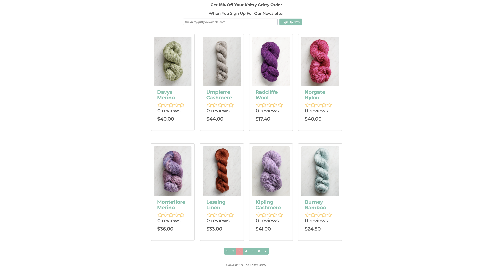
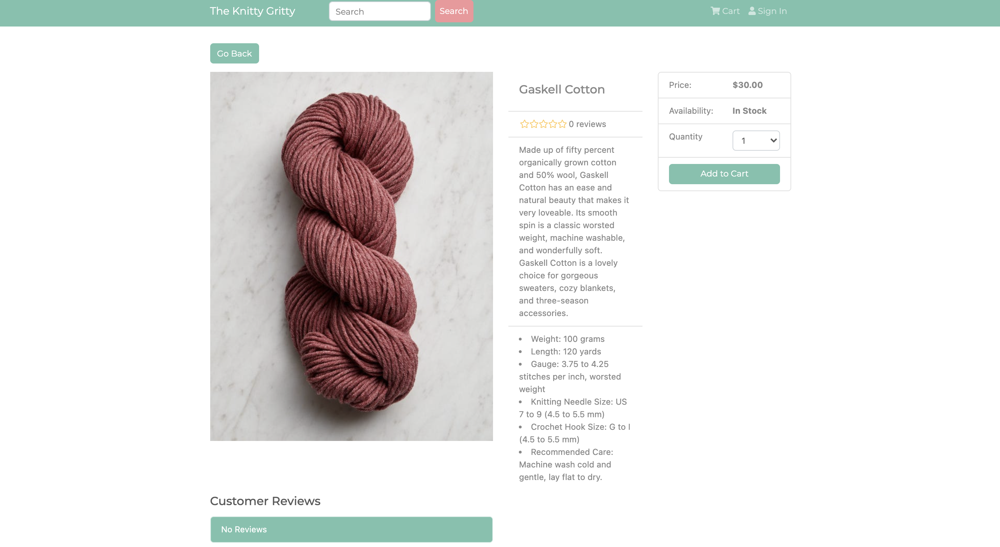

# The Knitty Gritty

[](https://opensource.org/licenses/MIT)

## Table of Contents

- [Description](#description)
- [User Story](#user-story)
- [Features of the Application](#features-of-the-application)
- [Preview of The Knitty Gritty](#preview-of-the-knitty-gritty)
- [Links](#links)
- [Built Using](#built-using)
- [Usage](#usage)
- [License](#license)
- [Questions](#questions)

## Description

Welcome to The Knitty Gritty, where you can find the yarns and tools to help you create wonderful and inspiring things.
The Knitty Gritty is an eCommerce application that is built using React, Redux, Node, Express, and MongoDB. The
application features a fully-functioning shopping cart with PayPal and credit/debit payments, a product rating/review
system, and admin capabilities to manage customers, products, and orders.

All product images, graphics, and some content are the copyrights and property of Purl Soho®
and [purlsoho.com](https://www.purlsoho.com/), where exquisite yarns, fabrics, and tools can
be [purchased](https://www.purlsoho.com/new.html).

Although The Knitty Gritty has an inventory of products, full-featured shopping cart, product reviews and ratings,
administrative product and user management, and Paypal (sandbox) and credit card integration, this is just a friendly
reminder that it is a sample eCommerce application. If any of these products interest you, please do look to make a
purchase at [Purl Soho®](https://www.purlsoho.com/).

## User Story

```
AS AN online customer,
I WANT TO search for products,
SO THAT I CAN find the ones I want to buy.

GIVEN an eCommerce application,
WHEN I search for a product by name or category,
THEN I can view products and their respective images with details for each product.

WHEN I have found a product that I would like to purchase,
THEN I can add it to my cart from the product page.

WHEN I authenticate myself,
THEN I can see my account details and past orders.

WHEN trying to register for an account,
THEN I am informed clearly of any errors, so that I can be properly authenticated to create an account.

WHEN I go to make a purchase,
THEN I can submit my credit card details or Paypal information and get authorization to complete my checkout.

WHEN I have made a purchase,
THEN I will get my order fulfilled in a timely manner.

```

## Features of the Application

- Easy login and registration process with simplified forms and authentication.
- Product search feature for user-friendly filtering.
- Extensive, detailed product descriptions.
- Products and adverts featured on carousel to engage the user.
- Shopping cart with multiple features that aids user in proceeding to checkout.
- Shipping process for user to add their shipping address and figure their delivery cost.
- Order summary page for user to verify purchase before committing to payment.
- Secure in-app payments through credit card integration and Paypal.
- For an optimal checkout process, the user is provided with a detailed invoice of their order.
- After completing purchase, user is provided with shipping status. (Admin product management allows ability to mark
  order as delivered upon delivery.)
- User can get notified about discounts and sales by signing up for the mailing list.
- Product reviews and ratings are available for users that want to choose the best product and helps build the company's
  reliability.
- Product pagination to aid in user-friendly shopping experience.
- Admin management for all order details, product inventory, product creation/edit/deletion, and users.
- Full-featured checkout process (delivery method, payment method/integration, order summary, detailed invoice, etc.)
- Database seeder for products and users.

## Preview of The Knitty Gritty






## Links

- [Deployed Application](https://the-knitty-gritty.netlify.app)

- [Github Repository](https://github.com/rh9891/TheKnittyGritty)

## Built Using

Listed below are the frameworks, libraries, and guides that made building this application possible:

- [Express](https://expressjs.com/)
- [MongoDB](https://www.mongodb.com/what-is-mongodb)
- [Node](https://nodejs.org/en/about/)
- [Purl Soho](https://www.purlsoho.com/)
- [React](https://reactjs.org/docs/getting-started.html)
- [Traversy Media Tutorials](https://www.traversymedia.com)

## Usage

Below is a sample customer login for accessing most features of the application:

```
The Knitty Gritty Customer Login:

Email: spetrillo@example.com
Password: GoldenGirl1
```

```
PayPal Sandbox Account Login:

Email: spetrillo@example.com
Password: uhKH1z<.
```

## License

The MIT License (MIT)

Copyright (c) 2021 Romie Hecdivert

Permission is hereby granted, free of charge, to any person obtaining a copy of this software and associated
documentation files (the "Software"), to deal in the Software without restriction, including without limitation the
rights to use, copy, modify, merge, publish, distribute, sublicense, and/or sell copies of the Software, and to permit
persons to whom the Software is furnished to do so, subject to the following conditions:

The above copyright notice and this permission notice shall be included in all copies or substantial portions of the
Software.

THE SOFTWARE IS PROVIDED "AS IS", WITHOUT WARRANTY OF ANY KIND, EXPRESS OR IMPLIED, INCLUDING BUT NOT LIMITED TO THE
WARRANTIES OF MERCHANTABILITY, FITNESS FOR A PARTICULAR PURPOSE AND NONINFRINGEMENT. IN NO EVENT SHALL THE AUTHORS OR
COPYRIGHT HOLDERS BE LIABLE FOR ANY CLAIM, DAMAGES OR OTHER LIABILITY, WHETHER IN AN ACTION OF CONTRACT, TORT OR
OTHERWISE, ARISING FROM, OUT OF OR IN CONNECTION WITH THE SOFTWARE OR THE USE OR OTHER DEALINGS IN THE SOFTWARE.

## Questions

If you have any questions, comments, or issues regarding this application, please do not hesitate to contact me
via [Github](https://github.com/rh9891).
